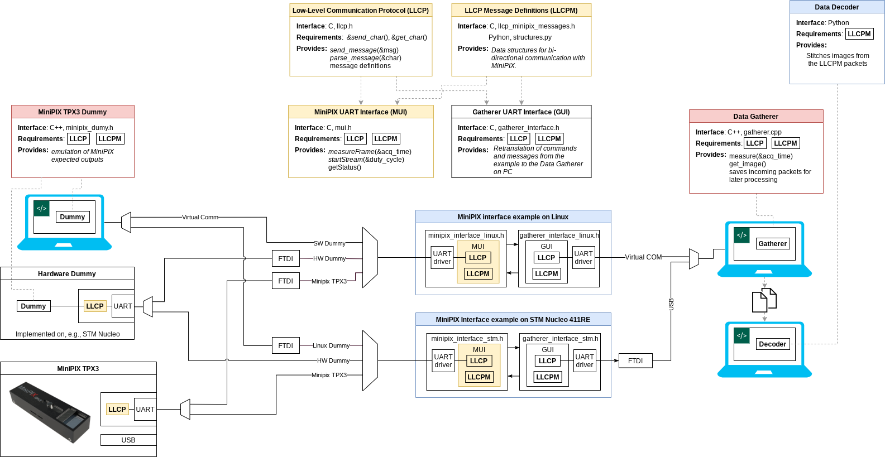

# MiniPIX UART Interface (MUI) - Software

[](../fig/diagram.pdf)

## LLCP - Low-level Communication Protocol

* **C library**
* UART link layer between the MiniPIX and MUI
* Capable of sending messages with up to 255 bytes of payload
* Can send data in binary or hexadecimal (for easier debugging)
* RAM efficient: uses a single buffer to store received data and to present them to the user when decoded

## MUI - MiniPIX UART Interface

* **C library**
  * needs "virtual" methods to be implemented by the HW integrator
* uses LLCP to communicate with the MiniPIX
* provides routines for controling the MiniPIX
* calls user callbacks when data arrive

## Example interface

* Example implementation of MUI on
  * Linux
  * STM32F411RE Nucleo

## Dummy - the MiniPIX emulator

* Responds identically as the MiniPIX over the UART
* Linux Implementation:
  * Loads real Timepix [data from a database](https://github.com/vzlusat/vzlusat1-timepix-data)
* HW implementation (**TODO**)
  * Possibly STM32F411RE Nucleo or Blue Pill
  * Could store a few real images
  * Will probably randomly generate images using store track data

## Gatherer - PC data receiver from the Example interface over FTDI

Saves incoming packeted data into files.

### OpenCV Visualization

```bash
sudo apt install libopencv-dev
```

## Decoder - PC data decoder

*TODO*

Stitches packeted data from files into viewable images.

## Vzlusat1-timepix-data

A repository containing Timepix data obtained by the VZLUSAT-1 satellite.
The data is used in the Dummy to emulate measurements.

Download the data by updating the git submodule:
```bash
git submodule update --init --recursive
```

# Running in Tmux sessions

The `tmux` subfolder contains tmuxinator sessions ready for testing.

1. Install `tmux` and `tmuxinator`:
```bash
sudo apt-get -y install tmux tmuxinator
```

2. compile all the Linux software
```bash
./compile.sh
```

1. If testing with the STM32F4 example, compile and flash the microcontroller -> [README.md](./example_interface/stm32f411).

2. Run `./start.sh` in the appropriate `tmux/{all_virtual, interface_hw}` sessions.

**Screenshot of the Dummy, Linux MUI Example and the Gatherer running in Linux PC:**

