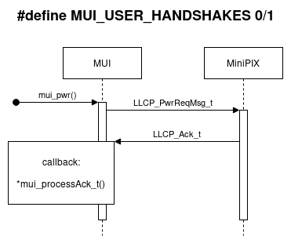
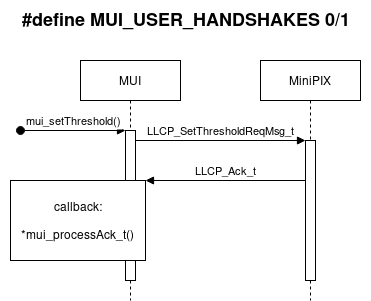
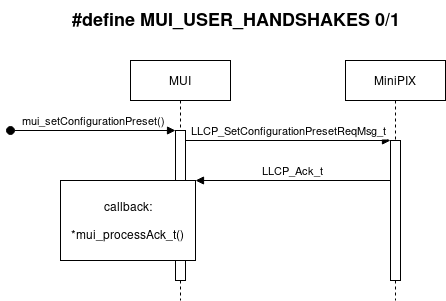
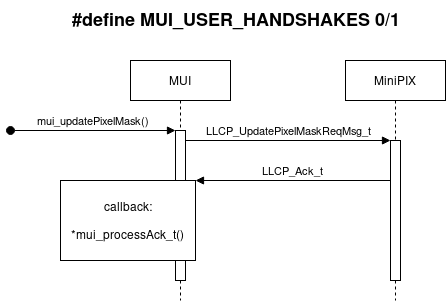

# MiniPIX UART Interface (MUI)

This is a C99 library that facilitates interraction with MiniPIX over UART.
This library is supposed to be incorporated into application code by an integrator of MiniPIX.

More general info and context in the general [README](../README.md).

## Pre-build requirements

The MUI should be compilable without any requirements and modifications from the integrator.
However, several compilation directives can be used to modify the behaviour of the MUI and the underlying LLCP.

### LLCP customization

LLCP can operate in either binary or hexadecimal transmission mode.
MiniPIX will most probably be set for the binary (default).
However, if you use LLCP for a custom project, or if you have MiniPIX set explicitly for HEX, change the behavior during compilation by the following define before including `mui.h`.
```C
#define LLCP_COMM_HEXADECIMAL 1
```

Debug print can be enabled in LLCP by defining:

```C
#define LLCP_DEBUG_PRINT 1
```

For more niche options, see .

### MUI customization

MUI allows the user/integrator to handle the communication _acking_ manually by defining:
```C
#define MUI_USER_HANDSHAKES 1
```
It could be useful if the user/integrator requires more control in timings of the incomming data.
For details, please see the communication diagrams below under the label `#define MUI_USER_HANDSHAKES 1`.

## Run-time initialization

Adapting MUI requires to pass pointers to user implementated and hardware-specific functions.

## Operating MiniPIX with the MUI

TODO

## Communication flow diagrams

### mui_pwr()



### mui_getStatus()


### mui_getTemperature()


### mui_measureFrame()


### mui_setThreshold()



### mui_setConfigurationPreset()



### mui_updatePixelMask()


